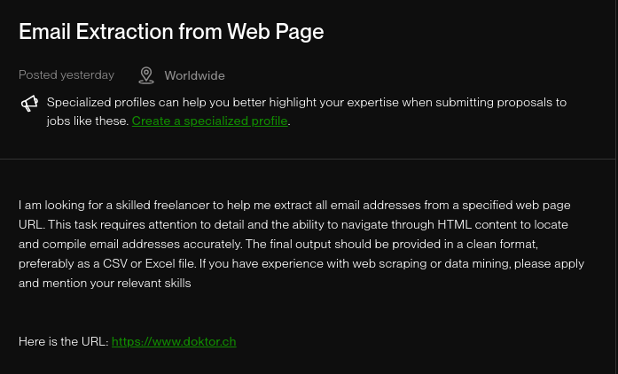

# Email Collecting Challenge

## Description

Source of the challenge:



I was finding a web scraping problem and I found this challenge. I thought it would be a good opportunity to use my knowledge of Web Automation and also to learn something new.

## The Challenge

The challenge is to collect all the email addresses from the website https://www.doktor.ch and save them to a CSV file.

## Thinking Process

First, I thought about the approach to collect the emails. I thought about using a headless browser like Puppeteer to navigate through the website and collect the emails. But when I explored the website, I found out that the website is server-side rendered, so I don't need a headless browser to collect the emails.

Then, I was thinking about `linkedom` to parse the HTML and collect the emails with regex. But the website has a lot of pages and I need to collect the emails from all the pages. So, I need to navigate through all the pages and collect the emails. Then, I thought about using a queue to collect the emails from all the pages and avoid duplicates. Which I did.

## Technologies used

-   Node.js
-   TypeScript
-   Redis
-   BullMQ
-   Puppeteer
-   linkedom

## Installation

1. Clone the repository
2. Install the dependencies

```bash
pnpm install
```

3. Create a `.env` file and add the following environment variables:

```bash
REDIS_URL=
```

4. Run the worker

```bash
pnpm start:worker
```

5. Run the collector

```bash
pnpm start
```

## Output

-   `emails.csv` - The final output file with the emails
-   `db/emails.json` - The emails as they are collected
